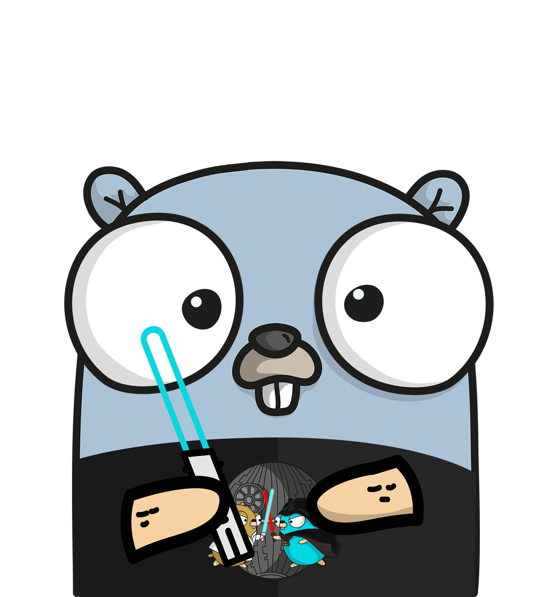

<h1 align="center">
   
  Go Polls API (Workshop)
</h1>

Learn to create a production ready backend REST API service in GO using echo.

## ✍ Pre-Requisites

- Go 1.9+ Installed and added to the $PATH
- Patience

### ⚡️ How to access this repository

This workshop is laid out in phases. Each branch (except main) represents an end of phase of learning.
If you directly want to jump to a specific phase then checkout that branch in your local and start coding along.

